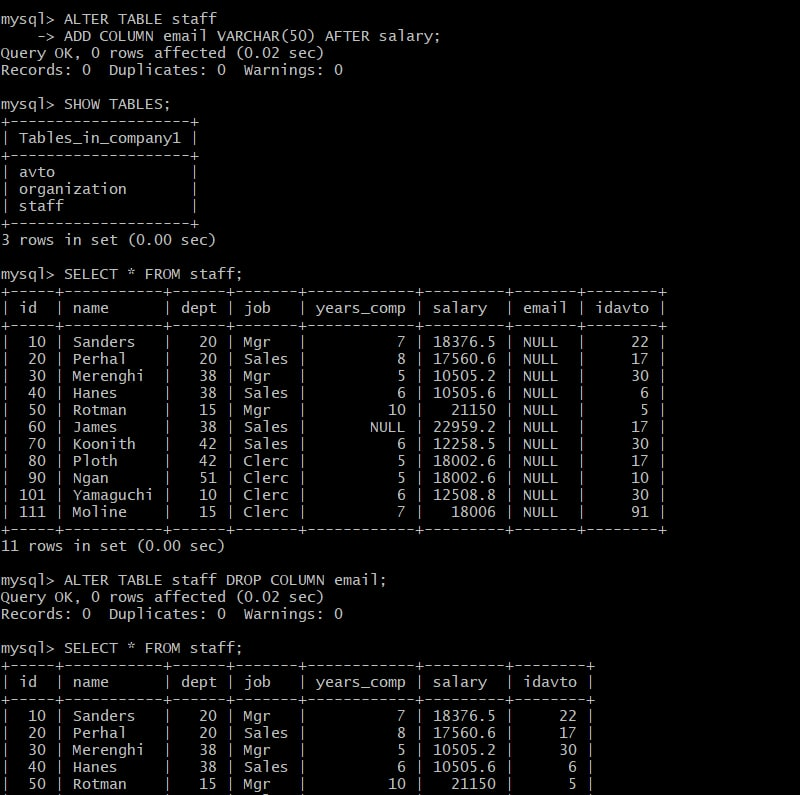
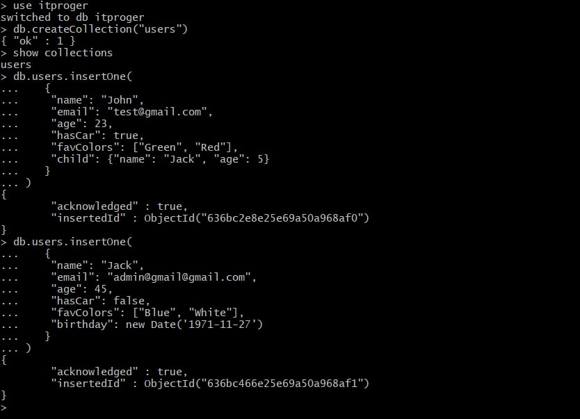

## DevOps L1 course
## Database Administration.  Home task 

### PART 1
1. Download MySQL server for my OS on VM.
2. Install MySQL server on VM.

I used the following commands to install MySQL server for Centos 7

>sudo yum update    (update our system)

>sudo wget https://dev.mysql.com/get/mysql80-community-release-el7-7.noarch.rpm   (download the MySQL repositories)

>sudo rpm -Uvh mysql80-community-release-el7-7.noarch.rpm

(prepare the repository so we could later install MySQL packages from it)

>sudo yum install mysql-server   (Install MySQL)

>sudo systemctl start mysqld

>sudo systemctl status mysqld   (Start MySQL and check its Status)

3. Select a subject area and describe the database schema, (minimum 3 tables) -  Data base Company includes Organizations, employees and company cars
4. Create a database on the server through the console.
>CREATE DATABASE company1;

>USE company1;

 

**Create 1st table "organization" and view them:**


**Create 2nd table "staff" and view them:**


**Create 3rd table "avto" and view them:**

 

5. Filling in the table and viewing the tables.


 


>mysql> SELECT * FROM avto


6. Construct and execute SELECT operator with WHERE, GROUP BY and ORDER BY.

6.1.  SELECT rows from the Staff table that contain  employees who work in the 38th department

```
SELECT dept, name, job FROM staff WHERE dept=38;
```
6.2. SELECT from the Staff table employees working in department number 20 and sort the records by the number of years worked in ascending order:
 
``` 
SELECT name, job, years_comp 
 FROM staff WHERE dept=20 
 ORDER BY years_comp ASC;
```
6.3.  Select the number of cars by models for all employees:

```
SELECT avto.model, COUNT(staff.id) AS numbermodel 
FROM staff JOIN avto ON staff.idavto=avto.idavto
GROUP by model; 
```
 

7. Execute other different SQL queries DDL, DML, DCL.

7.1. DCL-Data Control Language
Select the names, job and number of years worked for employees whose salary is between 12,000 and 18,000 inclusive:

```
 SELECT name, job, years_comp 
 FROM staff WHERE salary BETWEEN 12000.00 AND 18000.00;
```
7.2 DDL-Data Definition Lamguage 
 Adding/removing a new column in a table staff:

```
ALTER TABLE staff
ADD COLUMN email VARCHAR(50) AFTER salary;
```
```
ALTER TABLE staff DROP COLUMN email;
```

 

7.3 DML - Data Manipulation Language
 Inserting one row into the table, New employee:
 
 ```
 INSERT INTO staff(id, name, dept, job, years_comp, salary, idavto) VALUES
 (66, 'Kermish', 15, 'Clerc', 4, 15000.00, 17);
```

 

Updating organization ID 8 department 84:
```
UPDATE organization
SET manger=320, location='Disney' WHERE deptnumb=84;
```
 

8. Create a database of new users with different privileges. Connect to the
database as a new user and verify that the privileges allow or deny certain
actions.

8.1 Creating a user with full privileges:
>CREATE USER 'Gusevazh'@'localhost' IDENTIFIED BY 'Chuguev2024!';

>GRANT ALL PRIVILEGES ON *.* TO 'Gusevazh'@'localhost';

>FLUSH PRIVILEGES;

>exit

**Log in as a new user and create a table**
>mysql -uGusevazh -p
```
CREATE TABLE computers (
    -> id INT NOT NULL,
    -> model VARCHAR(30),
    -> monitor VARCHAR(30),
    -> PRIMARY KEY(id)
    -> );
```
 

8.2  Creating a user with limited privileges:

> CREATE USER 'guseva'@'localhost' IDENTIFIED BY 'Chuguev2025!';

>GRANT CREATE, ALTER, INSERT, SELECT ON *.* TO 'guseva'@'localhost';

>FLUSH PRIVILEGES;

>exit

**Log in as a new user and try to delete the table**
```
 mysql -uguseva -p
 USE company1;
 drop table computers;
```
**Get an error access denied**

ERROR 1142 (42000): DROP command denied to user 'guseva'@'localhost' for table 'computers'

 


### PART 2

 Make backup and Restore of your database.
 
 

 


### PART 3 - MongoDB

Configure the package management system (yum).

Install the MongoDB packages.

Start MongoDB.

1.  Create a database. Use the use command to connect to a new database (If it doesn't exist, Mongo will create it when you write to it).
2. Create a collection. Use db.createCollection to create a collection. I'll leave the subject up to you. Run show dbs and show collections to view your database and collections.
3. Create some documents. Insert a couple of documents into your collection. I'll leave the subject matter up to you, perhaps cars or hats.


Create a database - itproger

Create Collection - users

 

To display results in a format that is easy to read:

 

4. Use find() to list documents out.

Find all records in the user's collection except field _id and sort by age in ascending order
> db.users.find({}, {_id: 0}).sort({age: 1})

 
